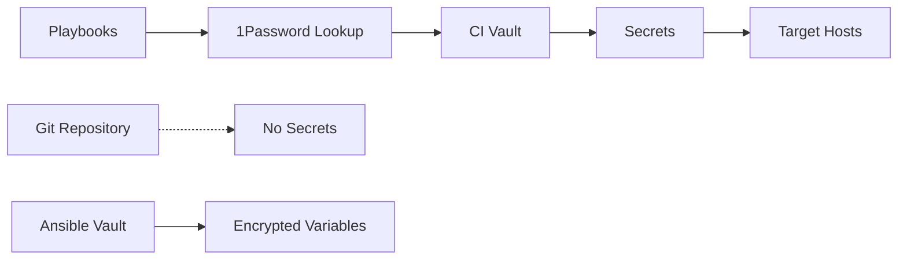

# 📚 Documentation Hub

[](.)
[](.)
[](.)
[](.)

Welcome to the comprehensive documentation hub for the Ansible Infrastructure Automation Platform. This directory serves as your central navigation point for all project documentation.

## 🗺️ Documentation Map

### 📋 Core Documentation

| Component | Description | Link | Status |
|-----------|-------------|------|--------|
| **Main README** | Project overview and quick start | [📄](../README.md) | ✅ Complete |
| **Playbook Collection** | Comprehensive playbook guide | [📄](../playbooks/README.md) | ✅ Complete |
| **Inventory Management** | Dynamic and static inventory | [📄](../inventories/README.md) | ✅ Complete |
| **Variable Configuration** | Group and host variables | [📄](#-variable-management) | ✅ Complete |

### 🏗️ Infrastructure Playbooks

| Playbook | Provider | Documentation | Features |
|----------|----------|---------------|----------|
| `create-hetzner.yaml` | Hetzner Cloud | [📖](../playbooks/infrastructure/create-hetzner.md) | Server provisioning, auto-config |
| `create-debian-lxc-pve.yaml` | Proxmox VE | [📖](../playbooks/infrastructure/create-debian-lxc-pve.md) | LXC containers, networking |

### ⚙️ System Management Playbooks

| Playbook | Target Systems | Documentation | Features |
|----------|----------------|---------------|----------|
| `setup-generic-debian-by-ip.yaml` | Debian/Ubuntu | [📖](../playbooks/system/setup-generic-debian-by-ip.md) | Complete system setup, hardening |
| `update-inventory.yaml` | Tailscale Network | [📖](../playbooks/system/update-inventory.md) | Dynamic inventory sync |

## 🎯 Getting Started Paths

### 🚀 New User Journey

1. **📖 Start Here**: [Main Project README](../README.md)
   - Project overview and architecture
   - Prerequisites and installation
   - Quick start guide

2. **🔧 Setup Environment**: [Installation Guide](#-installation-guide)
   - Ansible configuration
   - 1Password CLI setup
   - SSH key configuration

3. **📋 Choose Your Path**:
   - **Infrastructure**: [Create new servers](../playbooks/infrastructure/)
   - **System Management**: [Configure existing systems](../playbooks/system/)
   - **Variables**: [Customize configurations](#-variable-management)

4. **🎭 Run First Playbook**: [Playbook Guide](../playbooks/README.md)
   - Interactive and automated modes
   - Common patterns and examples

### 🔄 Experienced User Quick Access

| Task | Direct Link | Quick Command |
|------|-------------|---------------|
| Create Hetzner server | [Guide](../playbooks/infrastructure/create-hetzner.md) | `ansible-playbook playbooks/infrastructure/create-hetzner.yaml` |
| Setup Debian system | [Guide](../playbooks/system/setup-generic-debian-by-ip.md) | `ansible-playbook playbooks/system/setup-generic-debian-by-ip.yaml` |
| Update inventory | [Guide](../playbooks/system/update-inventory.md) | `ansible-playbook playbooks/system/update-inventory.yaml` |
| Check configuration | [Troubleshooting](#-troubleshooting) | `ansible-config dump --only-changed` |

## 📁 Project Architecture

### Directory Structure Overview

```
📦 ansible/
├── 📚 docs/                      # 👈 You are here
│   └── 📄 README.md              # This documentation hub
├── 🎭 playbooks/                 # Automation playbooks
│   ├── 🏗️  infrastructure/       # Cloud provisioning
│   │   ├── create-hetzner.yaml
│   │   ├── create-hetzner.md
│   │   ├── create-debian-lxc-pve.yaml
│   │   └── create-debian-lxc-pve.md
│   ├── ⚙️  system/               # System management
│   │   ├── setup-generic-debian-by-ip.yaml
│   │   ├── setup-generic-debian-by-ip.md
│   │   ├── update-inventory.yaml
│   │   └── update-inventory.md
│   └── 📋 README.md              # Playbook collection guide
├── 🧩 roles/                     # Reusable components
│   ├── base-system/
│   ├── security/
│   ├── shell-config/
│   └── [8 more roles]/
├── 🏠 inventories/               # Host management
│   ├── tailscale.py             # Dynamic inventory
│   └── README.md                # Inventory guide
├── 👥 group_vars/                # Group configurations
│   └── README.md                # Group variables guide
├── 🖥️  host_vars/                # Host-specific configs
│   └── README.md                # Host variables guide
├── 📋 requirements.yaml          # Dependencies
├── ⚙️  ansible.cfg               # Platform configuration
└── 📖 README.md                 # Main project documentation
```

## 🔧 Variable Management

### Configuration Hierarchy

The platform uses a structured approach to variable management:

| Level | Scope | Documentation | Precedence |
|-------|-------|---------------|------------|
| **Host Variables** | Individual hosts | [📄](../host_vars/README.md) | Highest |
| **Group Variables** | Host groups | [📄](../group_vars/README.md) | Medium |
| **Role Defaults** | Role-specific | See individual role docs | Lowest |

### Quick Configuration Examples

#### Environment-Specific Variables
```bash
# group_vars/production.yaml
environment: production
log_level: warn
backup_retention_days: 30
```

#### Host-Specific Overrides
```bash
# host_vars/web-server-01.yaml
nginx_worker_processes: 8
ssl_certificate: custom-cert.pem
```

## 🧩 Role Documentation

### Available Roles

| Role | Purpose | Key Features | Documentation |
|------|---------|--------------|---------------|
| `base-system` | Foundation | Package mgmt, timezone, users | [📄](../roles/base-system/README.md) |
| `security` | Hardening | SSH, firewall, fail2ban | [📄](../roles/security/README.md) |
| `shell-config` | User env | ZSH, Oh-My-Zsh, aliases | [📄](../roles/shell-config/README.md) |
| `monitoring-tools` | Observability | Metrics, logging | [📄](../roles/monitoring-tools/README.md) |
| `backup-tools` | Data protection | Backrest, scheduling | [📄](../roles/backup-tools/README.md) |
| `container-tools` | Containerization | Docker, Docker Compose | [📄](../roles/container-tools/README.md) |
| `proxmox-setup` | Virtualization | Proxmox configs | [📄](../roles/proxmox-setup/README.md) |
| `pangolin-newt` | API integration | Newt + Pangolin API | [📄](../roles/pangolin-newt/README.md) |

### Role Usage Patterns

```yaml
# In playbooks - include roles
- name: Configure base system
  include_role:
    name: base-system
  vars:
    timezone: "Europe/Berlin"

# In playbooks - role dependencies
roles:
  - role: base-system
  - role: security
    when: security_enabled | default(true)
```

## 🔒 Security Documentation

### Secret Management Architecture

The platform implements a comprehensive security model:



### Security Components

| Component | Function | Implementation |
|-----------|----------|----------------|
| **1Password** | Secret storage | `community.general.onepassword` lookups |
| **SSH Keys** | Authentication | Key-based auth only, no passwords |
| **Ansible Vault** | Config encryption | Encrypted variable files |
| **Firewall** | Network security | UFW with restrictive defaults |
| **Fail2ban** | Intrusion prevention | Automated IP blocking |

### Required Secrets in 1Password

The 'CI' vault must contain:

```yaml
# API Access
Hetzner Cloud API: {token: "hcloud_..."}
Proxmox API: {Host-Name: "...", Benutzername: "...", TokenID: "...", Anmeldedaten: "..."}
Tailscale Token: {Anmeldedaten: "tskey-auth-..."}

# SSH Access
MBA SSH - Public Key: {Benutzername: "ssh-rsa
 AAAA..."}

# Service Integration
Pangolin - Mannheim: {Anmeldedaten: "...", Host-Name: "...", Organisation: "..."}
```

## 🧪 Testing & Development

### Development Workflow

```bash
# 1. Syntax validation
ansible-playbook --syntax-check playbooks/**/*.yaml

# 2. Linting
ansible-lint .
yamllint .

# 3. Dry run testing
ansible-playbook --check --diff playbooks/infrastructure/create-hetzner.yaml

# 4. Development deployment
ansible-playbook playbooks/infrastructure/create-hetzner.yaml --limit development

# 5. Production deployment
ansible-playbook playbooks/infrastructure/create-hetzner.yaml --limit production
```

### Quality Assurance

| Check | Command | Purpose |
|-------|---------|---------|
| **Syntax** | `ansible-playbook --syntax-check` | YAML/Jinja2 validation |
| **Linting** | `ansible-lint .` | Best practices enforcement |
| **Security** | `yamllint .` | Security policy compliance |
| **Dry Run** | `ansible-playbook --check` | Change preview |

## 🔍 Troubleshooting

### Common Issues Quick Reference

| Issue | Symptoms | Solution | Documentation |
|-------|----------|----------|---------------|
| **Connection refused** | SSH timeouts | Check keys, network | [SSH Guide](#ssh-troubleshooting) |
| **1Password auth failed** | Secret lookup errors | Verify CLI setup | [1Password Guide](#1password-troubleshooting) |
| **Role not found** | Import errors | Install collections | [Dependencies](../requirements.yaml) |
| **Host unreachable** | Ping failures | Check inventory | [Inventory Guide](../inventories/README.md) |

### Diagnostic Commands

```bash
# System health check
ansible all -m ping --inventory inventories/tailscale.py

# Configuration verification
ansible-config dump --only-changed

# Inventory validation
ansible-inventory --list --inventory inventories/tailscale.py

# Secret access test
ansible localhost -m debug -a "var=lookup('community.general.onepassword', 'Test Item', vault='CI')"
```

### SSH Troubleshooting

```bash
# Test SSH connectivity
ssh -T root@target-host

# Debug SSH issues
ssh -vvv root@target-host

# Test with Ansible SSH settings
ansible all -m ping --ssh-extra-args="-vvv"
```

### 1Password Troubleshooting

```bash
# Verify 1Password CLI
op account list
op vault list

# Test vault access
op item list --vault CI

# Debug secret lookups
op item get "Test Item" --vault CI
```

## 📊 Monitoring & Observability

### Built-in Monitoring

The platform includes comprehensive monitoring capabilities:

- **📈 System Metrics**: Resource utilization tracking
- **📝 Centralized Logging**: Structured log aggregation  
- **🚨 Alerting**: Proactive issue notification
- **📋 Asset Tracking**: Inventory and configuration management

### Health Check Commands

```bash
# Infrastructure health
ansible all -m service -a "name=sshd state=started"
ansible all -m shell -a "uptime"

# Service verification  
ansible all -m shell -a "systemctl is-active docker" --limit docker_hosts
ansible all -m shell -a "tailscale status" --limit tailscale_hosts

# Resource monitoring
ansible all -m shell -a "df -h /" 
ansible all -m shell -a "free -m"
```

## 🤝 Contributing Guidelines

### Documentation Standards

- **📝 Comprehensive**: Every feature must be documented
- **🔄 Current**: Keep docs synchronized with code
- **🎯 User-focused**: Write for the end user experience
- **📋 Structured**: Use consistent formatting and organization
- **🔗 Linked**: Cross-reference related documentation

### Content Guidelines

1. **Clear Headings**: Use descriptive section headers
2. **Code Examples**: Include working code samples  
3. **Visual Aids**: Add diagrams and tables where helpful
4. **Error Handling**: Document common issues and solutions
5. **Version Info**: Note version compatibility and changes

## 📈 Roadmap & Future Enhancements

### Planned Documentation Improvements

- [ ] **📱 Interactive Tutorials**: Step-by-step guided workflows
- [ ] **🎥 Video Guides**: Visual walkthroughs for complex procedures  
- [ ] **📊 Architecture Diagrams**: Visual system architecture documentation
- [ ] **🔧 API Documentation**: Automated API reference generation
- [ ] **🧪 Testing Guides**: Comprehensive testing methodology
- [ ] **🚀 Deployment Patterns**: Advanced deployment strategies

### Integration Roadmap

- [ ] **Confluence Integration**: Corporate wiki synchronization
- [ ] **Slack Notifications**: Documentation update alerts  
- [ ] **Version Control**: Documentation versioning strategy
- [ ] **Automated Updates**: Auto-generated sections from code
- [ ] **Search Enhancement**: Advanced search capabilities

---

## 📞 Support Channels

### Getting Help

| Type | Channel | Response Time |
|------|---------|---------------|
| **Questions** | GitHub Discussions | 1-2 business days |
| **Bug Reports** | GitHub Issues | 1 business day |
| **Security Issues** | Private email | 4 hours |
| **Feature Requests** | GitHub Issues | 1 week |

### Community Resources

- **📖 Documentation**: This comprehensive guide
- **💬 Discussions**: Community support and knowledge sharing
- **🐛 Issue Tracker**: Bug reports and feature requests  
- **📧 Mailing List**: Release announcements and updates

---

**🎯 Ready to get started?** Choose your path above and dive into the comprehensive documentation for your use case!

**🔍 Looking for something specific?** Use the quick reference tables above to jump directly to what you need.